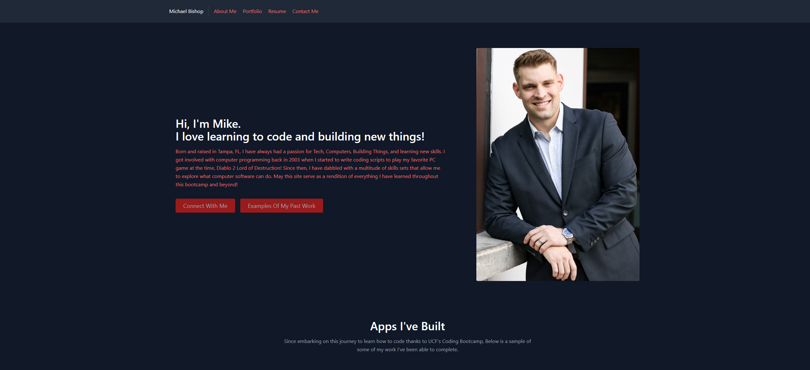

# Module 20: React-Portfolio

## React-Portfolio

## Description
As an aspiring web-developer / programmer / dev. It is everyone's dream to land a dev job coming out of a bootcamp. Thanks to this bootcamp, that dream has already become a reality. I have landed a position as a back-end automation tester / jr dev for a local cyber-security company.

Likewise, as a result. I had to power thru this assignment as quickly as possible as I am following behind with real work. React is a wonderful library and utility that allows dev's to organize their cards and objects in a much more manageable fashion. It is incredibly powerful at displaying and organizing functionality for high-end usage.

## Table of Contents
  * [Installation](#installation)
  * [Usage](#usage)
  * [Links](#links)
  * [Contributions](#contributions)
  * [Questions](#questions)
  
  
## Installation
Ensure Node.js, React CLI, and all other pre-req's are installed on your machine first.
```
Run "Npm install" to install all dependencies and packages from package.json
```

## Usage
Enter 

```
npm start
``` 

inside the root directory in your terminal of choice. This will start up the React application in your localhost browser of choice

## Links
 
  * Github Repository URL: (https://github.com/Theothermike5544/React-Portfolio)
  
## Contributions

  Fork, request, or contact me at the details below.
  

## Questions

[](https://github.com/Theothermike5544) 

[](https://www.linkedin.com/in/michael-bishop-1b3358104/)

You can reach me at mrbishop5544@gmail.com with any question regarding this project!
